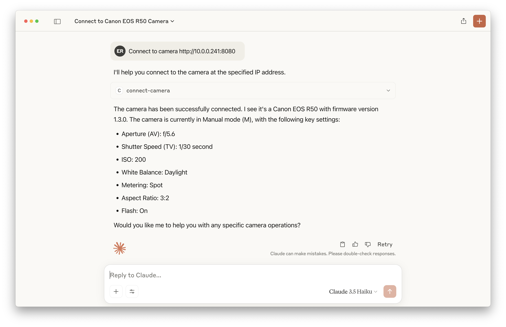

# Canon MCP 

This MCP server helps you to control Canon cameras that support CCAPI through natural language commands processed by Large Language Models (LLMs). Interact with your Canon camera using conversational language instead of traditional interfaces.

> ⚠️ This project is currently under active development. Features and documentation may be incomplete or subject to change.

## Features

### Connecting to camera


```
connect to camera http://10.0.0.241:8080
```

### Livestream


```
start livestream
```

### Take photos at intervals

```
take 10 photos 10 seconds apart
```

### Adjust shooting settings

```
set iso 320

set tv 1/4000
```

## Available tools

- **connect-camera**  
  Connect to a Canon camera via CCAPI.

- **take-photo**  
  Take a photo with the camera using the current shooting settings.

- **get-shooting-settings**  
  Get all of the present values and ability values of the shooting parameters that can be acquired and supported by the Canon camera.

- **change-shooting-mode**  
  Change shooting mode of the camera (e.g. "m" for Manual, "av" for Aperture Priority, "tv" for Shutter Priority, "p" for Program AE, "fv" for Flexible Priority, "a+" for Scene Intelligent Auto, "c3/c2/c1" for Custom Modes, "bulb" for Bulb).

- **set-aperture-setting**  
  Set the aperture (AV) setting.

- **set-shutter-speed-setting**  
  Set the shutter speed (TV) setting.

- **set-iso-setting**  
  Set the ISO setting.

- **get-autofocus-setting**  
  Get the present value of the AF operation setting.

- **set-autofocus-setting**  
  Set the AF operation setting.

- **get-battery-status**  
  Get battery status information.

- **get-storage-status**  
  Get storage status.

- **get-temperature-status**  
  Get temperature status.

- **get-datetime-setting**  
  Get date and time setting.

- **get-lens-information**  
  Get lens information.

- **restore-dial-mode**  
  Restore dial mode.

- **get-last-photo**  
  Get the last photo from the camera. The photo is saved to the output directory.

- **get-live-view-image**  
  Get live view image of the camera. This does not take a photo.

- **start-interval-photos**  
  Start taking photos at regular intervals.

- **get-interval-photos-status**  
  Get status of interval photos.

- **stop-interval-photos**  
  Stop taking photos at regular intervals.

- **get-owner-name**  
  Get the owner name set in the camera.

- **set-owner-name**  
  Set the owner name in the camera.

- **get-shutter-mode**  
  Get the shutter mode release of the camera.

- **set-shutter-mode**  
  Set the shutter mode release of the camera.

- **get-color-temperature**  
  Get the color temperature of the camera.

- **set-color-temperature**  
  Set the color temperature of the camera.

- **set-white-balance**  
  Set the white balance of the camera.

- **execute-autofocus**  
  Execute autofocus. This API only issues a focusing instruction and does not return the focusing results. For the focusing results, check the focus frame information in the Live View incidental information.

- **start-camera-livestream**  
  Start livestream in a browser.

- **stop-camera-livestream**  
  Stop livestream in a browser.

## Installation

**Clone the repo**

```sh
$ git clone git@github.com:ediardo/canon-mcp-server.git
# or
$ git clone https://github.com/ediardo/canon-mcp-server.git
```

**Build the project**

```sh
$ npm install

$ npm run build

$ npm run build-container
```

**Add the MCP server to your config file**

```json
{
  "mcpServers": {
    "canon": {
      "command": "node",
      "args": ["/ABSOLUTE/PATH/TO/REPO/build/mcp.js"]
    }
  }
}
```

Replace `/ABSOLUTE/PATH/TO/REPO` with the path where you cloned the project.

